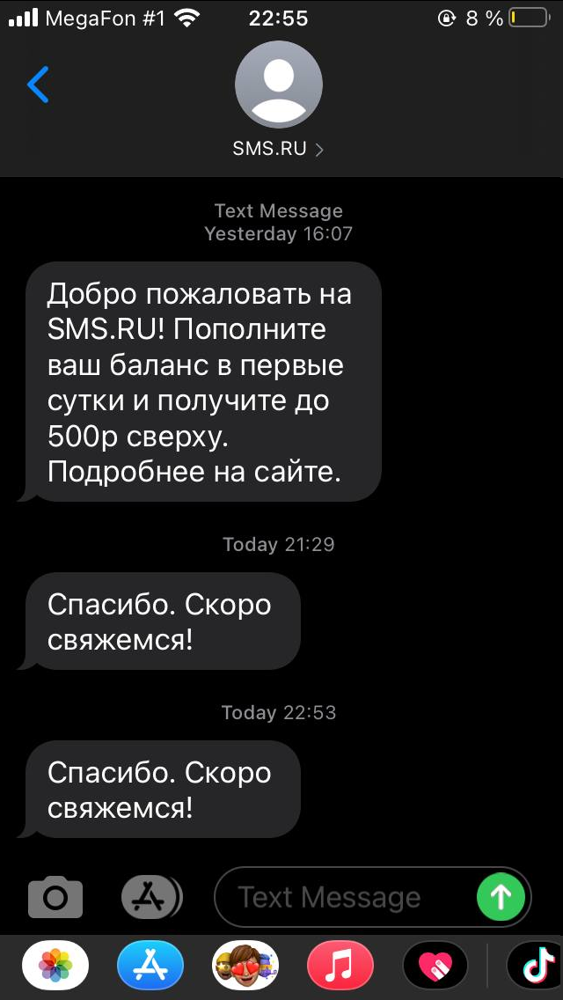

# MinerSite

Сайт Xi Miner сверстаный по макету https://www.figma.com/file/XcgIilhjeyIjJw3PsPalPe/%D0%9C%D0%B0%D0%B9%D0%BD%D0%B5%D1%80%D1%8B?node-id=153%3A90.

Форма обязательным параметром выбирает либо телефон, либо почту, можно и 2 ввести. Происходит валидация полей ввода на правильность введения и телефона и почты. 
Если ввести неправильно или ничего не ввести, то появятся красные надписи, которые обозначат ошибку.

При вводе эмейла отправляет письмо на почту. Для отправки писем использовала сервис www.emailjs.com

Если заполнить поле с телефоном, мне, как разработчику, приходят сообщения с текстом, который указан в коде как переменная message.(но только 5 раз в сутки, тк остальное платно)
Пользовалась сервисом отправки сообщений https://sms.ru

